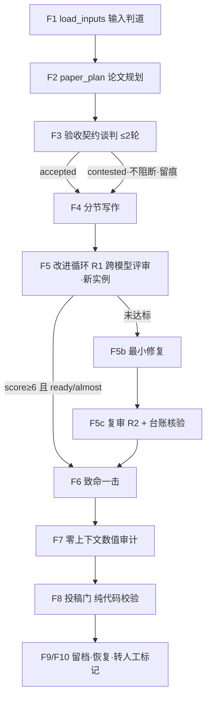
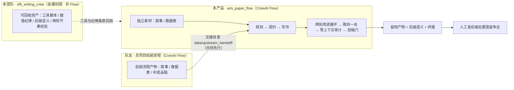

# ARIS 论文写作流程的 CrewAI Flow 化 · 最小可行产品方案

> 版本 v1.1 ｜ 日期 2026-08-31 ｜ 状态 **待审计** ｜ 工作名 `aris_paper_flow` ｜ 姊妹文档《技术方案 v1.1》
> 修订说明：澄清衔接对象为队友的**总项目前部进程**（CrewAI Flow）；sf6_writing_crew 为自建初步探索（非 Flow、ARIS 复用少），转为可回收资产库。
> 本文为 HTML 审计版的同源 Markdown 版本；交互演示（流水线阶段浏览器、停机判定演示）见 HTML 版。

---

## 1. 需求背景与资产盘点

团队技术版图有三块。**ARIS**（Auto-claude-code-research-in-sleep）是机制来源：一套运行在 Claude Code 上的科研 harness，其论文写作链（W3）用「跨模型新鲜线程评审 + 分层确定性审计门 + 文件化状态恢复 + 有界自主循环」四件套把一份叙事报告变成经过完整审计链的论文，实测将润色评分从 4/10 推到 8.5/10——但它绑定 Claude Code 运行时，靠 Markdown 技能与终端会话推进，无法被别的流水线编排。**sf6_writing_crew** 是我们自己用 CrewAI 做的初步探索：沉淀了白名单校验、数值纪律条款、两轮对抗节奏、留档后缀语义与一批工具脚本，但以顺序 Crew 串联为主、没有采用 Flow 编排，对 ARIS 机制的复用也少，直接拼不进总项目产线。第三块是**队友的总项目前部进程**：基于 CrewAI Flow 搭建，是整个项目产线的最前端，论文写作段要接的就是它。

于是本需求的逻辑很直接：论文写作段要成为总项目产线的后部，就必须与前部同框架——把 ARIS 的论文写作内核移植到 CrewAI Flow 上；sf6 初探的角色从「衔接对象」转为「可回收资产库」，工具与纪律条款直接搬运，编排层全部重写。这不是重写 ARIS，也不是继续修补 sf6，而是抽取 ARIS 内核、按 Flow 原语重新落地，与队友前部进程同底座拼装。队友前部进程的具体形态尚未见到代码，衔接采取**合同先行**：先定义本流程视角的最小交接契约并标注假设（第 7 节），待队友逐条确认。

**ARIS 可复用内核**（探查结论，全部对应仓库内技能文件）：跨家族评审 + 新鲜线程协议（`shared-references/reviewer-independence.md`，有 3/10 被连续会话洗成 8/10 的实证退化记录）；分层审计链与「verdict 由代码映射、禁静默跳过」的工件纪律；确定性外部验证器为真相源（exit code + 哈希防篡改）；文件化状态与断点恢复（REVIEW_STATE.json 24 小时续跑规则）；停机双条件 + MAX_ROUNDS 硬上限 + 先修后审 + 不藏弱点。其余（多后端路由、W1 选题链、W2 实验循环、过夜看门狗、取证扫描）判为可拆卸外壳。

### 资产四线盘点

| 资产 | 已验证的能力 | 缺口 / 未知 | 本产品取用方式 |
|------|------------|------------|--------------|
| ARIS harness | 验收契约谈判（≤3 轮）、改进循环（MAX_ROUNDS=2，双条件停机）、致命一击（原子点三分类 + 代码映射 verdict）、零上下文 claim 审计、义务台账、防刷分协议 | 绑定 Claude Code 运行时；产物为 LaTeX 英文生态 | 移植机制与提示词内核，重写为 Crew 编排 |
| sf6_writing_crew（自建初探，非 Flow） | 白名单校验器（validate_report）、数值纪律与主题锚定 prompt 条款、两轮对抗节奏实战经验、留档后缀语义、parse_vasp / make_charts / md2pdf / eval_run 工具脚本 | 顺序 Crew 串联、无 Flow 编排；ARIS 复用少；难以与 Flow 产线拼装 | 作为**可回收资产库**：工具脚本与纪律条款直接搬运，编排层全部重写 |
| 队友·总项目前部进程（CrewAI Flow） | [假设—待确认] 产线最前端，产出研究素材（选题 / 文献 / 实验数据 / 半成品稿） | 阶段划分、产物清单、目录约定均未见到代码 | 对齐框架底座；定义交接契约（合同先行，第 7 节） |
| CrewAI 1.15.10 | Flow 泛型状态、@listen/@router 标签路由、@persist SQLite 持久化与分叉恢复、事件总线、usage_metrics 成本核算 | 禁止方法自监听（循环需静态展开）；对话式 Flow 处于 experimental | 固定两轮静态展开；锁定版本与前部一致 |

### 术语约定

| 术语 | 含义 |
|------|------|
| 前部进程 | 队友基于 CrewAI Flow 搭建的总项目最前端流程，本流程的直接上游 |
| 跨家族评审 | 执行写作的模型与评审模型必须来自不同厂商家族；同家族评审只能记为 provisional（临时结论），不得视为独立验收 |
| 新鲜实例 | 每轮评审用全新 Crew 实例执行，不携带任何上一轮对话上下文，防止叙事累积导致的评分漂移 |
| 验收契约 | 写作前由执行者拟定、评审方挑战确认的一组可检验断言（10-20 条），终局审计以它为基准之一 |
| 致命一击 | 敌意审稿人提交单一最强拒稿段，裁判拆为 3-7 个原子点并三分类处置，verdict 由代码按计数表映射 |
| 义务台账 | 第一轮评审成立的弱点清单，第二轮必须逐条交代处置下落；既无核验记录也无处置记为删句绕过（UNRESOLVED_DISAPPEARANCE） |
| 投稿门 | 定稿前的纯代码终局校验（工件齐全、哈希新鲜、verdict 一致、禁静默），结果只有 accepted / provisional / no 三态 |

## 2. 需求目标与完成定义

近期目标是让「一份研究素材（或已有初稿）进、一篇带完整审计留痕的论文成稿出」这条链在 CrewAI Flow 上端到端跑通，评审环节达到跨家族独立标准。中期目标是与队友前部进程按交接契约完成对接：上游产物落盘后，本流程一条命令接手直至成稿。长期愿景是全项目形成一条以 CrewAI Flow 为底座的完整产线（前部进程 + 论文写作段统一编排或互导），防幻觉体系与具体课题解耦，换课题只换数据文件与锚定配置。

### MVP 完成定义（DoD）

| # | 完成项 | 判定口径（全部来自程序产物，不采信模型自评） |
|---|--------|--------------------------------------------|
| 1 | 独立模式端到端全绿 | 以模拟数据运行，产出无后缀留档（`论文_成稿_{stamp}.md/.pdf`），投稿门 overall = accepted |
| 2 | 精修模式实测 | 以「已有初稿」型样例运行（首版用 sf6 初探的历史终稿充当——我们自己的产物、现成可用），完成契约 + 两轮循环 + 审计链并留档 |
| 3 | 交接契约演练 | 按第 7 节契约模板手工构造一份上游交接样例（含 HANDOFF 清单），验证判道与溯源字段完整 |
| 4 | 评审独立性 | 评审记录 JSON 中 reviewer_family ≠ 执行家族；若降级为同家族，终报必须带 provisional 声明 |
| 5 | 防刷分四件套生效 | 每轮评审原文逐字落盘；停机判定由 review_gate 状态机给出；verdict 由代码映射；台账无 UNRESOLVED_DISAPPEARANCE |
| 6 | 断点恢复演练 | 人为中断后从 SQLite 状态分叉恢复，已完成阶段不重跑，恢复成功率 3/3 |
| 7 | 回归基线建立 | `eval_run.py --runs 3` 产出指标 JSON 并入库 git，作为后续改动的对照基线 |

量化口径沿用团队已有的度量习惯：白名单外数值数目标为 0；R1 到 R2 的评审综合分应有可解释的提升（≥1.0 分）或直接满足双条件停机；致命一击未决原子点中 critical 档目标为 0。耗时与成本不设硬指标，首版只记录基线（sf6 初探量级为单次 15-25 分钟、数元人民币，本流程多了契约谈判与两轮跨模型评审，预期 25-40 分钟）。

## 3. 产品定位、用户与场景

一句话定位：**给它一份研究素材或一篇已有初稿，产出一篇每个论断都经过对抗检验、每个数字都可对账、留痕完整到可当庭演示的论文成稿。** 它在总项目产线中承接队友前部进程的产出（产线后部），也能脱离产线独立运行（备好素材即可开工）；sf6 初探则退居素材源与测试夹具。

| 用户 | 场景 | 交互方式 |
|------|------|---------|
| 论文执笔人（本团队） | 拿到上游产物或实验数据，要一篇经得起审稿的成稿 | 备素材 → `python run.py` → 按留档后缀处置遗留争议 |
| 上游流程队友（总项目前部） | 前部 Flow 跑完，把产物按交接契约落盘 | 产物放 `data/upstream_handoff/`（含 HANDOFF 清单），本流程自动判道接手 |
| 答辩评委 / 审稿人 | 质疑「AI 写的论文可信吗」 | 现场展示验收契约、两轮评审轨迹、致命一击裁决书、投稿门报告（全带 SHA256 指纹） |

核心使用流程保持三步节奏：备素材 → 跑一条命令 → 验收产物（看文件名后缀决定是否需要人工处理）。用户不需要声明模式——程序按产物形态自动判道独立成稿还是精修升级；上游交接是否带 HANDOFF 清单只影响溯源信息完整度，不影响能否运行。

## 4. 功能需求详情（核心）

流水线共 10 个功能模块，按执行顺序编号 F1-F10。

### 阶段速览（HTML 版含可交互浏览器）

| 阶段 | 执行者 | 输入 → 输出 | 失败兜底 |
|------|--------|------------|---------|
| F1 load_inputs | prepare_inputs.py（纯代码） | data/ 固定路径 → mode + SOURCES_MANIFEST.json（SHA256） | 无有效输入显式报错列出检索路径，不猜测 |
| F2 paper_plan | plan_crew · qwen-plus | 素材包 → PAPER_PLAN.md（矩阵/结构/图表计划） | refine 模式从已有初稿反提矩阵 |
| F3 契约谈判 | contract_crew · 千问拟 + DeepSeek 挑战 | 矩阵 → 验收_契约_{stamp}.md | contested 留痕放行，终报降级 |
| F4 write_sections | write_crew · qwen-plus | 计划+契约+数据表 → 论文_初稿.md | refine 跳过本步；引用一律标待核实 |
| F5 review_r1 | review_crew · deepseek-v3 新实例 | 初稿 → 评审_记录_R1.json（原文逐字） | 解析失败 REVIEW_UNAVAILABLE fail-closed |
| F5b revise | revise_crew · qwen-plus | R1 弱点清单 → 修订稿 | 只做最小修复防新漂移 |
| F5c review_r2 | review_crew 新实例 + ledger.py | 修订稿 + R1 清单注入 → R2 记录 + 义务台账 | 未达标带后缀转人工，无第三轮 |
| F6 kill_argument | killer（DeepSeek）+ arbiter（qwen3.8-max 零温度） | 成稿 → 致命一击_{stamp}.json | 不适用也落 NOT_APPLICABLE 工件 |
| F7 claim_audit | claim_auditor（DeepSeek 零温度，零上下文） | 成稿+数据文件 → 数值_复核_{stamp}.json | 有数字无原始文件 → BLOCKED 转人工 |
| F8 verify_gates | verify_gates.py（纯代码） | 全部工件 → RUN_STATE.json（overall 三态） | 阻断项 → _未通过门 后缀 |
| F9/F10 finalize | archive.py + @persist | 成稿+状态 → 时间戳留档 + 终报 | PDF 缺工具跳过；遗留争议进 human_flags |

### F1 输入判道与素材标准化（纯代码 · 零 LLM）

流程启动时由 `tools/prepare_inputs.py` 扫描固定路径判定入口模式。优先扫 `data/upstream_handoff/`（上游交接目录，[假设—待确认] 含 HANDOFF.md 清单：产物路径、生成时间、来源 Flow 的 state.id）；按产物形态分流——叙事报告或数据表进入 standalone 模式（独立成稿），已成初稿（上游半成品、sf6 初探历史终稿、人工草稿）进入 refine 模式（精修升级）。上游目录为空时回落扫 `data/NARRATIVE_REPORT.md` 与 `data/vasp_results.md`（沿自 sf6 初探的七节模板）。多份并存取修改时间最新的一条。判道完成后提取三类关键素材：数值白名单源（数据表中全部「数值+单位」）、红线声明、方法学自查（未算项清单），生成 `SOURCES_MANIFEST.json`（每份素材的路径与 SHA256 指纹），作为后续所有审计的基准输入。任何路径都无法识别有效输入时，程序显式报错退出并列出它找过哪些位置，不做猜测性兜底。

### F2 论文规划（claims-evidence 矩阵）

由 paper_planner（qwen-plus）读取素材包，产出 `PAPER_PLAN.md`：一张 claims-evidence 矩阵（每条论断标注证据来源槽位、证据是否可得、预期落点章节）、5-8 节的章节结构、图表计划（只声明需要哪些图型，实际图表由回收自 sf6 初探的 make_charts.py 确定性绘制，不经 LLM）。矩阵的纪律是：每条 claim 必须绑定一个证据槽位；证据不可得的 claim 一律标记 DATA_NEEDED，不得进入正文承担强论证角色——这是 ARIS「缺证据发占位注释而非编造」规则在规划层的落点。refine 模式跳过新规划，改为从已有初稿反向提取矩阵，供后续审计对照（比对初稿实际论断与原始数据支持范围是否一致）。

### F3 验收契约谈判（跨家族）

写作开始前，claim_drafter（qwen-plus）依据矩阵拟定 10-20 条可检验断言，覆盖数值范围、结论边界、图表与正文对应关系；contract_challenger（deepseek-v3）逐条挑战：断言是否可测、证据是否真的可得、是否存在过度承诺。执行者修订后再提交一轮，MVP 上限 2 轮（ARIS 原版 3 轮，MVP 收紧以控时延）。两轮内达成一致即写 `验收_契约_{stamp}.md` 并冻结，作为终局审计基准之一；仍未一致则契约状态记为 contested，流程**不阻断**，继续写作但 human_flags 记录「契约争议」，终报 Submission-ready 强制为 no 并逐字附上争议双方立场。这个「谈崩也留痕放行」的行为是对 ARIS 同款规则的移植：机器拿不准的事交给人类，不硬判也不装作没事。

### F4 分节写作

section_writer（qwen-plus）按 PAPER_PLAN 的章节顺序逐节写作，context 链传递已完成章节，保持行文连贯。写作 prompt 移植 sf6 初探已验证的三条纪律：主题锚定条款（最高优先级，防写成无关课题）、数值纪律（计算设置照抄数据表、公式只写符号不代数值）、雷区黑名单（文献默认值与已知的替换手法）。缺证据处写 `<!-- DATA_NEEDED: 缺什么 -->` 注释而非编造内容。输出汇总为 `论文_初稿.md`。refine 模式跳过本步——上游半成品、初探终稿或人工草稿直接作为初稿进入改进循环。成稿若包含参考文献，每条引用标注「待核实」状态并汇入待核清单（完整的三轴引用审计列入 P1，见第 5 节）。

### F5 改进循环（固定两轮 + 双条件停机）

R1：cross_reviewer（deepseek-v3）以全新 Crew 实例评审初稿全文，输出严格 JSON：1-10 综合分、verdict（ready / almost / not_ready）、按严重度排序的弱点清单（每条附最小修复建议）。评审原文逐字落盘（`评审_记录_R1_{stamp}.json`），解析只提字段不改写。停机判定交给 `review_gate.py` 状态机：**score≥6 且 verdict∈{ready, almost} 双条件同时成立**才停机直转终审；单高分不停车（防「高分 + not_ready」的假阳性）。解析失败记 REVIEW_UNAVAILABLE，fail-closed 转修复并标记人工复核。未达标则 F5b：reviser（qwen-plus，复用写作配置）按弱点清单最小修复，遵循固定修复模式表：真 overclaim 收窄 scope 而非换软词、假设-正文矛盾重写、散布的警告并入 Limitations、术语跨节一致。F5c 复审 R2：又一个全新评审实例，R1 成立弱点清单经程序占位符注入逐条核验；`ledger.py` 合成义务台账，R1 弱点在 R2 既无核验记录也无处置即记 UNRESOLVED_DISAPPEARANCE。R2 之后恒转终审——固定两轮是 ARIS MAX_ROUNDS=2 的静态展开，也与团队在 sf6 初探中验证过的两轮对抗节奏一致。

### F6 致命一击

killer（deepseek-v3）扮演敌意审稿人，提交**单一**最强拒稿段（约 200 字，六轴择优：结论有效性 / 假设-主张错配 / 缺失证据义务 / 数值歧义 / 证据-主张差距 / 范围过卖；必须引用具体章节或数据条目，禁止含糊表态）。arbiter（qwen3.8-max，零温度）把攻击拆解为 3-7 个原子拒稿点，逐点三分类：answered_by_current_text / partially_answered / still_unresolved，附严重度。顶层 verdict 由 `verdict_map.py` 按计数表纯代码映射：任一 still_unresolved@critical 即 FAIL；存在 still_unresolved 或 critical 级 partial 即 WARN；**still_unresolved 为 0 才可能 PASS**。模型不参与自己 verdict 的判定。检测器判定不适用（如初稿无顶线泛化主张）时也必须落盘 NOT_APPLICABLE 工件，禁止静默跳过。

### F7 零上下文数值审计

claim_auditor（deepseek-v3，零温度）只读两份材料：当前成稿与数据文件。明确排除一切中间产物（规划、契约、评审记录、修订说明），防止确认偏置。检查七类数字失真：数值膨胀、best 挑选、配置错配、聚合数错、差值算错、图注-表格不符、范围过度声明。输出 findings JSON 并程序补写 _meta（成稿与数据文件的 SHA256 指纹），供投稿门做新鲜度校验。程序兜底沿用 sf6 初探已验证规则：findings>0 时 verdict 一律程序改写为 FAIL，不信任模型「4 findings + PASS」式的自相矛盾输出；解析失败显式标记转人工。白名单对账直接回收初探的 `validate_report.py`（纯代码，成稿中每个数值+单位必须命中白名单 / 白名单差和 / 推导值两位有效数字）。

### F8 确定性投稿门与留档

`verify_gates.py` 做终局校验，零 LLM 参与，检查五项：工件齐全性（规划、契约、两轮评审、致命一击、审计、台账全部在位）；新鲜度（各审计工件 _meta 哈希与当前成稿、数据文件一致，防「审计的是旧稿」的 STALE 状态）；verdict 一致性（findings 与 FAIL、critical 未决与 FAIL、台账开放与标记的对应关系）；禁静默（每个审计环节都有工件，阴性结论也有 NOT_APPLICABLE 记录）；后缀合成（按状态合成留档文件名后缀）。结果写 `RUN_STATE_{stamp}.json`，overall 三态：accepted（全绿）/ provisional（有非阻断瑕疵或同家族评审降级）/ no（存在阻断项）。`archive.py` 随后做时间戳留档（md 必出，PDF 走回收自初探的 pandoc+xelatex 管线，工具缺失自动跳过不阻断）。

### F9 状态持久化与断点恢复

Flow 类级启用 @persist（SQLite），每个方法执行后自动快照状态；人为中断后用 `restore_from_state_id` 分叉恢复（官方推荐语义，v1.14.5+）。恢复时按 state 中的阶段完成标记 + 产物存在性双重判断跳过已完成阶段，保证幂等。同时每轮写一份人读友好的 `RUN_STATE.json`（当前阶段、各审计结论、耗时、成本），与 SQLite 快照互为备份——这是 ARIS「文件化状态三件套」在 CrewAI 上的对应实现。与前部进程同框架的最大红利也在这里：两段流程未来可共享同一套持久化与恢复约定，甚至合并编排。

### F10 人工介入点与转人工标记

MVP 的所有人工介入都是「不阻断留痕」型：契约争议、致命一击 WARN、数值审计 BLOCKED（有数字主张但找不到原始数据文件）、语义类遗留争议，一律写入 human_flags 并反映到留档后缀与终报 Next Steps。终报的 Submission-ready 字段机器可判：仅投稿门 accepted 且无开放标记时为 yes。交互式审批（终端暂停等人裁决）用 CrewAI @human_feedback 能力实现，列入 P1——MVP 阶段先用「标记 + 留痕 + 后缀」把闭环走通，避免无人值守场景被阻塞。

## 5. MVP 范围裁剪

裁剪原则：ARIS 的「评审制度内核」全量保留（抽掉即退化成自嗨），「生态外壳」全部后置；sf6 初探只回收确定性资产（工具脚本、prompt 纪律、命名语义），不回收其顺序串联的编排方式。

| 来源能力 | 处置 | 理由 |
|---------|------|------|
| 验收契约谈判（ARIS） | **MVP**（上限 2 轮） | 先谈后写，终审基准的来源 |
| 改进循环（两轮 + 双条件停机，ARIS） | **MVP** | 体系反局部最优的主引擎 |
| 致命一击 + 代码 verdict 映射（ARIS） | **MVP** | 回答「这篇论文最大弱点是什么」的杀手锏 |
| 零上下文数值审计（ARIS + sf6 白名单） | **MVP** | 数字事实裁判权归代码；白名单校验器直接回收 |
| 义务台账 / 删句绕过检测（ARIS） | **MVP** | 机制清晰，纯代码可落地 |
| 断点恢复 / 状态留痕 | **MVP** | 长流程的存活性基础；@persist 即框架原生支持 |
| sf6 工具脚本（validate_report / make_charts / md2pdf / eval_run 思路） | **MVP 直接回收** | 确定性资产与编排方式无关，搬运即用 |
| sf6 数值纪律 / 主题锚定 / 雷区黑名单条款 | **MVP 直接回收** | 已实测把白名单外数值压到 0 的 prompt 资产 |
| 引用完整性三轴审计（ARIS） | P1 | 需逐条真实 web 检索；MVP 先出「待核清单」占位 |
| 交互式人机审批（@human_feedback） | P1 | MVP 用标记留痕先闭环，避免阻塞无人值守 |
| 过夜看门狗 / 心跳 / 会话恢复全家桶（ARIS） | P1 | MVP 按白天触发跑批设计；看门狗只检测不重启的原则届时照搬 |
| LaTeX 模板 / 英文投稿生态（ARIS） | P1 | MVP 对齐团队 markdown + pandoc 中文管线 |
| 多章节并行写作 | P1 | MVP 顺序写作保连贯；asyncio.gather 路径已留 |
| sf6 顺序 Crew 编排层 | **不回收** | 非 Flow 编排正是本次重写的对象；只取其资产不取其骨架 |
| W1 选题链 / W2 实验循环（ARIS） | **不做**（范围外） | 前部进程与团队决策已覆盖；本流程只管写作段 |
| 证明检查器 / 取证扫描 / rebuttal / 海报（ARIS） | **不做** | 面向理论论文与投稿后生命周期，远超 MVP |
| 多后端评审路由 / meta-optimize / research-wiki（ARIS） | **不做** | 生态扩展件，首期无复利场景 |

## 6. 评估体系、准确性与兜底

准确性定义与团队一脉相承：论文中每个数值可对账、每条论断有证据下落、每个评审结论可追溯。指标全部从程序产物提取（留档文件、JSON 留痕、状态库），不采信模型自评——这是回归评估可信的前提。

### 评估指标

| 指标 | 数据来源 | MVP 目标 |
|------|---------|---------|
| 白名单外数值数 | validate_report.py | 0 |
| R1→R2 综合分变化 | 两轮评审 JSON | ≥ +1.0，或 R1 即双条件达标 |
| 致命一击 critical 未决原子点 | 致命一击 JSON | 0 |
| 义务台账开放数 / 删句绕过数 | 义务台账 jsonl | 开放数如实呈报；绕过数 0 |
| 评审解析失败率 | REVIEW_UNAVAILABLE 计数 | < 10% / 轮 |
| DATA_NEEDED 槽位数 | 正文注释扫描 | 如实呈报（>0 不是失败，是诚实） |
| 断点恢复成功率 | 恢复演练记录 | 3/3 |
| 端到端耗时 / 成本 | usage_metrics + 计时 | 记录基线（预期 25-40 分钟） |

### 兜底机制（凡异常必有既定行为，无静默路径）

| 异常场景 | 系统行为 |
|---------|---------|
| 评审 JSON 解析失败 | REVIEW_UNAVAILABLE，fail-closed 转修复并标记人工复核，绝不即兴放行 |
| 跨家族模型不可用 / 配额耗尽 | 降级千问家族顶评审位，全部评审结论标 provisional，终报声明「未达跨家族标准」 |
| 数据不足以支撑论断 | DATA_NEEDED 占位注释 + 待办清单，不编造 |
| 契约两轮未谈拢 | contested 留痕放行，终报 Submission-ready: no |
| 有数字主张但缺原始数据文件 | 审计 BLOCKED，停下转人工，不许宣布完成 |
| 上游交接缺 HANDOFF 清单 | 降级运行（无溯源字段），human_flags 标记「交接不完整」 |
| PDF 工具链缺失 | 自动跳过 PDF，markdown 管线不受阻 |
| 进程中断 | SQLite 状态分叉恢复，已完成阶段不重跑 |

## 7. 衔接契约与资产回收

衔接设计遵循团队已验证的哲学：**文件即接口**。前部进程与本流程不共享进程、不共享状态库，只通过约定路径下的文件交接，成功与否由留档文件名后缀机械判定。由于前部进程的代码尚未见到，本节契约全部按「本流程视角的最小需求」提出并标注假设，构成与队友对齐的谈判基线。

### 输入契约

| 入口 | 路径 | 格式要求 |
|------|------|---------|
| 独立·叙事 | `data/NARRATIVE_REPORT.md` | ARIS 叙事模板：研究问题 / 方法 / 结果 / 结论边界 |
| 独立·数据 | `data/vasp_results.md` | 沿自 sf6 初探的七节模板；表中数值即白名单，只放数据不放示例值 |
| 上游·交接 | `data/upstream_handoff/` + `HANDOFF.md` | [假设—待确认] 上游产物三型之一：叙事 / 数据表 / 已成初稿；HANDOFF.md 列产物清单、生成时间、来源 Flow 的 state.id；缺 HANDOFF 可降级运行并标记 |
| 素材·已有初稿 | `data/` 下任意 md | sf6 初探历史终稿、人工草稿等，视同「已成初稿」型进入精修模式 |

**待与前部进程队友确认清单**：交接目录规范（路径、命名、是否保留默认 `data/upstream_handoff/`）；上游产物形态与版本（三型中的哪几种、有无未覆盖形态）；HANDOFF 清单字段（路径 / 生成时间 / 来源 state.id 之外还需要什么）；触发方式（手动拷贝 / 共享目录 / 同仓路径直写）；溯源互认（是否互认 state.id 与 SHA256 约定）；合并节奏（独立仓互导 vs 单仓多 Flow）。

### 输出契约（output/，git 不入库）

| 产物 | 说明 |
|------|------|
| `论文_成稿_{stamp}{后缀}.md / .pdf` | 成品；后缀按状态合成，无后缀即全绿 |
| `论文_计划_{stamp}.md` | claims-evidence 矩阵 + 章节结构 |
| `验收_契约_{stamp}.md` | 断言清单 + 挑战记录 + accepted/contested 状态 |
| `评审_记录_R1/R2_{stamp}.json` | 评审原文逐字保存 + 解析字段 + 评审家族标记 |
| `致命一击_{stamp}.json` | 拒稿段 + 原子点三分类 + 代码映射 verdict |
| `数值_复核_{stamp}.json` | findings + _meta SHA256 指纹 |
| `义务_台账_{stamp}.jsonl` | R1 弱点逐条处置状态（append-only） |
| `RUN_STATE_{stamp}.json` | 终态快照：阶段表 + 各审计结论 + overall + 耗时成本 + 上游溯源字段 |

### 后缀语义（沿自 sf6 初探命名体系，扩展衔接类标记）

| 后缀 | 触发条件 | 人工动作 |
|------|---------|---------|
| `_契约争议` | 契约 contested | 人工仲裁断言分歧后重跑 |
| `_评审未达标` | R2 后仍未满足双条件 | 读两轮评审轨迹判断补数据还是改叙事 |
| `_致命一击未过` | kill verdict = FAIL 或 WARN | 读原子点清单处置（WARN 可人工确认放行） |
| `_数值存疑` | 复核 findings > 0 或解析失败 | 对账数据文件，修数据或修表述 |
| `_未通过门` | verify_gates 存在阻断项 | 读 RUN_STATE.json 的 gate_results 定位 |
| `_交接不完整` | 上游产物缺 HANDOFF 清单或关键素材 | 与上游队友补齐交接件后重跑 |

### 资产回收清单（来自 sf6 初探）

| 资产 | 回收方式 | 改动 |
|------|---------|------|
| validate_report.py 白名单校验 | 整文件回收 | 入口参数适配本流程产物路径 |
| make_charts.py 图表管线 | 整文件回收 | 图型按 PAPER_PLAN 需要选用，不足跳过 |
| md2pdf.py（pandoc+xelatex） | 整文件回收 | 无（缺工具自动跳过的逻辑保留） |
| parse_vasp.py VASP 解析 | 条件回收 | 仅当上游产物为原始 VASP 输出时启用（待确认清单第 2 条） |
| eval_run.py 回归评估思路 | 重写实现 | 指标换成本流程口径（分数轨迹 / 台账 / 投稿门） |
| 数值纪律 / 主题锚定 / 雷区黑名单条款 | prompt 文本搬运 | 落进 agents/*.jsonc |

工程约定沿用团队习惯（均源自 sf6 初探的实践）：Agent 与 Crew 用 jsonc 声明、UTF-8 编码、`.env` 管理密钥、留档后缀语义；框架统一为 CrewAI 1.15.10 锁定版本，与队友前部进程同底座。与前部进程的对齐点提案见技术方案第 11 节。

## 8. 风险与审计决策点

| 风险 | 影响 | 缓解 |
|------|------|------|
| 前部进程形态未确认，契约可能返工 | 交接层重新对齐 | 合同先行 + 全部标注假设；standalone 模式不依赖上游，主线进度不受牵制 |
| 引入 DeepSeek 评审家族与「全千问、比赛合规」口径冲突 | 答辩口径分裂 | 保留纯千问降级路径（provisional 标记）；合规结论请团队裁决（决策点 1） |
| 固定两轮不收敛 | R2 仍 not_ready，成稿带后缀转人工 | 设计如此：两轮修不掉的多半是数据缺证据，正确动作是补计算而非多磨几轮 |
| 跨家族模型时延 / 配额不稳 | 端到端时间超出预期 | 评审类调用集中且次数有限（≤6 次大调用）；降级路径保底 |
| 评审 JSON 解析失败率偏高 | 循环退化为全转人工 | 零温度 + 严格格式 prompt + 程序兜底重试一次；失败率进回归指标盯防 |
| 中文 markdown 生态与期刊模板差距 | 后期排版返工 | MVP 明确产出形态为「成稿内容 + 审计留痕」；LaTeX 化列 P1 |
| CrewAI 版本升级破坏 Flow 语义 | 框架行为变化 | 锁定 1.15.10；升级需过回归基线，且与前部进程同步升级 |

**审计决策点（请逐条裁决）**：

1. **评审模型家族**：跨家族评审是否引入 dashscope 托管的 DeepSeek？若合规要求纯千问，MVP 将以 provisional 模式运行，防刷分强度打折，请权衡。
2. **上游契约确认**：第 7 节「待确认清单」六条，请与队友过一遍定稿；若短期无法确认，是否按默认假设先行开发（standalone 主线不受影响）。
3. **引用防线时机**：若论文必须带文献引用，三轴引用审计是否从 P1 提前到 MVP？（代价：web 检索外部依赖与额外时延）
4. **仓库与合并节奏**：独立新仓库，还是并入总项目仓做单仓多 Flow？影响与前部进程的合并远近和团队分工界面。
5. **sf6 资产回收边界**：工具脚本直接拷贝进本仓库，还是抽成两仓共用的公共包？make_charts 现有图型是否够用（建议维持「按需选用、不足跳过」）？

---

## 依据材料

- ARIS 仓库（Auto-claude-code-research-in-sleep）：README_CN、AGENT_GUIDE、paper-writing / auto-review-loop / kill-argument / paper-claim-audit 等技能定义（用户提供的本地仓库）
- sf6_writing_crew 仓库（用户自建的 CrewAI 初步探索，顺序 Crew 编排、ARIS 复用较少）：工具脚本、数值纪律条款、留档后缀语义等可回收资产（用户提供的本地仓库）
- 队友总项目前部进程：已确认基于 CrewAI Flow；具体形态未见代码，衔接契约以标注假设方式提出待确认（用户提供的信息）
- CrewAI 中文文档库 v1.15.10：Flows 概念、状态管理、检查点、事件监听、人机反馈（用户提供的本地文档库）
- 产品设计文档 v2.0（Flow + 四道防线），sf6_writing_crew 项目，2026-08-26（作为初探经验参考，用户提供的本地文档）
