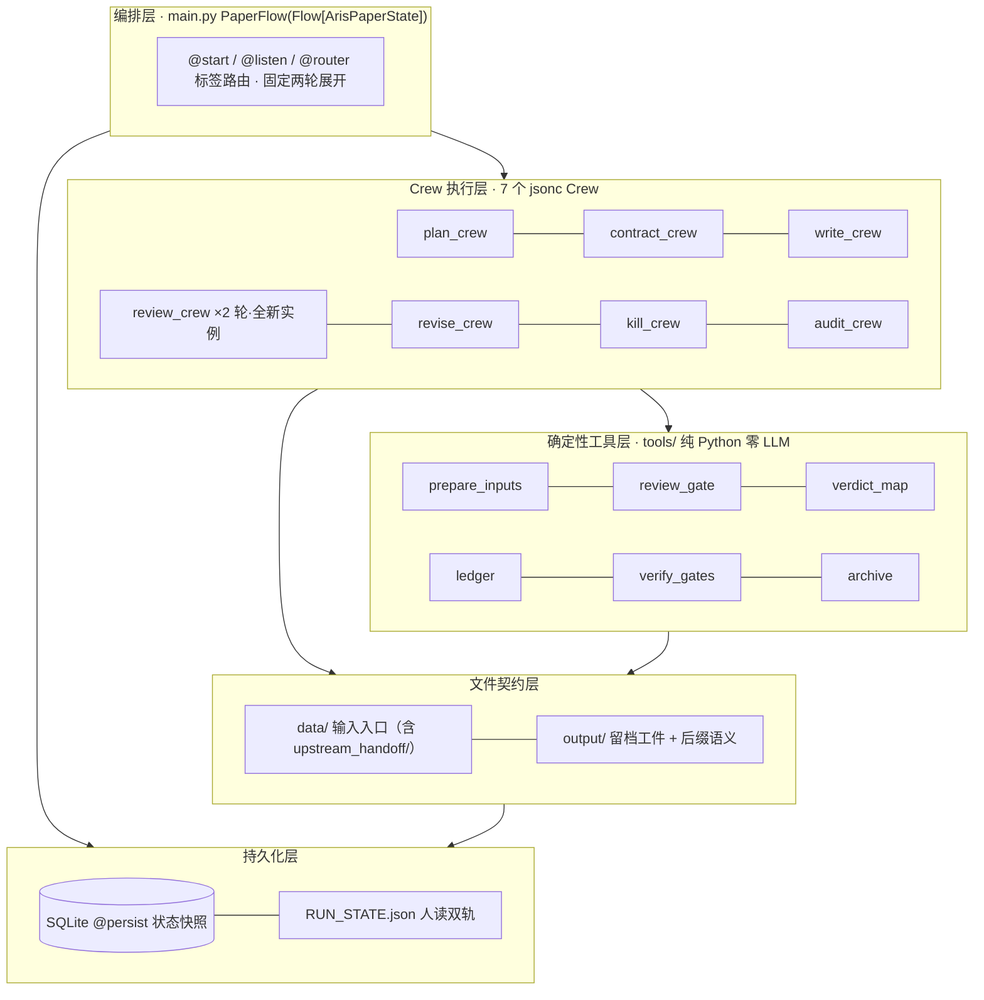
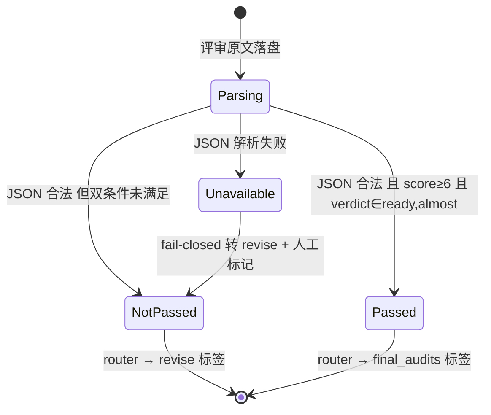

# aris\_paper\_flow 技术方案 · ARIS 论文写作流程的 CrewAI Flow 实现

> 版本 v1.1 ｜ 日期 2026-08-31 ｜ 状态 **待审计** ｜ 框架 CrewAI 1.15.10（锁定）｜ 姊妹文档《MVP 产品方案 v1.1》
> 修订说明：澄清衔接对象为队友的**总项目前部进程**（CrewAI Flow）；sf6\_writing\_crew 为自建初步探索（非 Flow），作为确定性资产来源回收。
> 本文为 HTML 审计版的同源 Markdown 版本；交互演示（停机判定演示器）见 HTML 版。

***

## 1. 设计目标与硬约束

本方案要回答一个问题：ARIS 的评审制度内核，如何在 CrewAI Flow 的原语（@start / @listen / @router / @persist）上不失真地落地。失真的判定标准很具体——跨家族独立性是否保住、verdict 是否仍由代码产出、状态是否仍可恢复、循环是否仍有界。sf6 初探证明了团队用顺序 Crew 串联也能把论文写出来，但拼不进以 Flow 为底座的总项目产线；本方案把它的确定性资产全部保留，把编排层换到 Flow 上。

| ARIS 内核机制            | CrewAI Flow 落点                                                       | 保真要点                      |
| -------------------- | -------------------------------------------------------------------- | ------------------------- |
| 跨家族评审 + 新鲜线程         | 评审 Crew 用 deepseek-v3；每轮 `load_crew()` 重建全新实例 kickoff                | 实例不跨轮复用；评审家族写入留痕 JSON     |
| 分层审计链 + 工件纪律         | kill / audit 两个独立 Crew + 各自固定文件名工件；阴性也落 NOT\_APPLICABLE              | 禁静默跳过由 verify\_gates 逐项核查 |
| verdict 由代码映射        | `verdict_map.py` / `review_gate.py` 纯 Python 计数表                     | 模型只产原子点，不产顶层结论            |
| 确定性验证器为真相源           | `verify_gates.py` 五项检查写 RUN\_STATE.json，overall 三态                   | 哈希新鲜度校验防「审计旧稿」            |
| 文件化状态与恢复             | 类级 @persist（SQLite）+ `restore_from_state_id` 分叉 + RUN\_STATE.json 双轨 | 幂等：阶段标记 + 产物存在性双判断        |
| 有界自主循环               | 固定两轮静态展开（review\_r1 → revise → review\_r2），双条件停机                     | R2 后恒转终审，无第三轮路径           |
| claims-evidence 矩阵贯穿 | PAPER\_PLAN.md 为 plan / write / audit 三段共同输入                         | 审计对照矩阵查「论断-证据」错配          |

**硬约束（违反任何一条即方案不成立）**：

- 评审模型与执行模型必须异家族；同家族运行只能记 provisional。
- 一切顶层结论（停机、verdict、投稿门）由确定性代码产出，LLM 无权自判。
- 所有异常路径显式留痕（后缀 / human\_flags / NOT\_APPLICABLE），无静默放行。
- 编排底座与队友前部进程统一：CrewAI 1.15.10 锁定；工程习惯沿用团队 sf6 初探沉淀（jsonc 配置、UTF-8、.env、文件即接口）。

## 2. 总体架构

五层结构：编排层是唯一的控制流真相源；Crew 层只做 LLM 调用不做流程判断；确定性工具层承接一切可以写成代码的检查与合成；文件契约层对内传递中间产物、对外衔接前部进程；持久化层保证可恢复。



层间数据流沿用团队 sf6 初探已验证的实践：**Crew 之间不通过内存传大文本，一律经 output/ 中间文件（output\_file 字段）**；Pydantic 状态只携带路由决策、计数与标记等小字段。这样每个中间产物天然可审计、可断点重放，也避免大文本进状态库拖慢快照。与 sf6 初探不同的是，把这些文件环节串起来、决定「下一步走哪条边」的控制流，从顺序脚本换成 Flow 的声明式路由——这正是能与前部进程互认、互导、合并编排的前提。

## 3. Flow 骨架设计

骨架保持团队熟悉的节奏（load → 产线 → 审计 → 对抗 → 路由 → 定稿，sf6 初探即按此节奏顺序串联），差异点有三：入口增加契约谈判段；对抗段换成「评审-修复」循环；终局段换成确定性投稿门。路由标签只用 `write` / `write_flagged` / `revise` / `final_audits` 四个，均与方法名不同名（规避 flow\_definition 的自引用校验）。

```python
class PaperFlow(Flow[ArisPaperState]):

    @start()
    def load_inputs(self):
        # prepare_inputs.py 判道：upstream_handoff / standalone；写 SOURCES_MANIFEST.json
        ...

    @listen(load_inputs)
    def paper_plan(self):
        # plan_crew → output/论文_计划.md（claims-evidence 矩阵）
        ...

    @listen(paper_plan)
    def negotiate_contract(self):
        # contract_crew ≤2 轮；state.contract_status = accepted | contested
        ...

    @router(negotiate_contract)
    def route_contract(self):
        return "write" if self.state.contract_status == "accepted" else "write_flagged"

    @listen(or_("write", "write_flagged"))   # 争议不阻断，但带标记走写作
    def write_sections(self):
        # standalone：write_crew 分节写作；refine：跳过（已有初稿直接进循环）
        ...

    @listen(write_sections)
    def review_r1(self):
        # 全新 review_crew 实例（deepseek-v3）；评审原文逐字落盘
        ...                                             # review_gate.py 判停机 → state

    @router(review_r1)
    def route_r1(self):
        return "final_audits" if self.state.review_passed else "revise"

    @listen("revise")
    def revise_paper(self):
        # revise_crew 按 R1 弱点最小修复（固定修复模式表）
        ...

    @listen(revise_paper)
    def review_r2(self):
        # 又一全新评审实例；R1 成立清单占位符注入；ledger.py 合成台账
        ...

    @router(review_r2)
    def route_r2(self):
        return "final_audits"        # 固定两轮：R2 后恒转终审

    @listen("final_audits")
    def kill_argument(self):
        # kill_crew：killer 攻击 + arbiter 原子点；verdict_map.py 映射 verdict
        ...

    @listen(kill_argument)
    def claim_audit(self):
        # audit_crew 零上下文对账；findings>0 程序强制 FAIL；补 _meta 指纹
        ...

    @listen(claim_audit)
    def verify_gates(self):
        # 纯代码五项检查 → RUN_STATE.json（overall: accepted/provisional/no）
        ...

    @listen(verify_gates)
    def finalize(self):
        # archive.py 时间戳留档 + 后缀合成 + 终报；flow.plot() 导流程图
        ...
```

### 关键设计决策

- **为什么固定两轮静态展开而不是循环**：CrewAI v1.15.x 拒绝方法自监听（changelog 明确），而 ARIS 的 MAX\_ROUNDS=2 本来就是硬上限；团队在 sf6 初探中已按两轮对抗节奏跑通过端到端（虽是顺序编排，节奏经验直接迁移）。静态展开同时满足框架约束、ARIS 有界循环原则与团队既有经验，是最稳的交集。
- **契约争议为什么不阻断**：ARIS 原版 contested 契约会覆盖 AUTO\_PROCEED 暂停等人裁。MVP 按「白天有人值守触发」场景设计，改为留痕放行 + 终报降级（Submission-ready: no），把仲裁压力显式交给后缀语义；P1 引入 @human\_feedback 后恢复阻塞语义。
- **为什么 or\_ 组合两个写作入口**：accepted 与 contested 两条路径的业务动作完全相同（分节写作），只差一个 human\_flags 标记；用 `or_("write", "write_flagged")` 合并监听，避免复制两份方法体。
- **评审新鲜实例的实现**：每轮在方法内重新 `load_crew(Path(...))` 并 kickoff，不做任何 Crew 对象复用或会话续接——这是「新鲜线程协议」在 CrewAI 上的等价物，成本上多一次配置解析，换来零上下文污染。
- **refine 模式为什么只是「跳过写作段」**：已有初稿（上游半成品、sf6 初探终稿、人工草稿）与全新成稿共享全部质量机制（契约、循环、审计、投稿门），唯一差异是初稿来源；用 state.mode 控制段跳过，不另建流程类。

## 4. 状态模型 ArisPaperState

状态设计沿用团队初探 PaperState 的克制原则：只放路由决策、计数与标记；大文本一律走文件。全部字段有默认值，保证从任意快照分叉恢复时状态完整。

```python
class ArisPaperState(BaseModel):
    stamp: str = ""                  # 运行时间戳 %Y%m%d_%H%M%S，留档共用
    mode: str = "standalone"         # standalone | refine（输入判道写入）
    source_ref: str = ""             # 素材溯源：上游 HANDOFF 的 state.id 或文件名
    stage_status: dict[str, str] = {}  # 阶段 → running/done/failed/skipped（幂等依据）
    contract_status: str = "pending"  # pending | accepted | contested
    review_scores: list[float] = []    # R1/R2 综合分轨迹
    review_verdicts: list[str] = []    # ready | almost | not_ready
    review_passed: bool = False        # review_gate 双条件判定结果
    review_parse_error: bool = False   # REVIEW_UNAVAILABLE 标记
    reviewer_family: str = "deepseek"  # deepseek | qwen（qwen 即 provisional）
    provisional: bool = False         # 同家族降级评审标记
    kill_verdict: str = ""            # PASS|WARN|FAIL|BLOCKED|NOT_APPLICABLE
    kill_unresolved: int = 0          # still_unresolved 原子点计数
    audit_findings: int = 0
    audit_parse_error: bool = False
    ledger_open: int = 0              # 义务台账开放条目数
    human_flags: list[str] = []        # 转人工标记（契约争议/WARN确认/交接不完整…）
    gate_results: dict[str, str] = {}  # verify_gates 各检查项 → pass/fail
    overall: str = ""                 # accepted | provisional | no
```

三点说明。其一，`review_scores` 与 `review_verdicts` 按轮追加，是「分数轨迹」指标的直接数据源，回归评估从留档 JSON 而非从模型自读取数。其二，`stage_status` 是恢复幂等的关键：恢复处理器先查标记再查产物文件存在性，两者一致才跳过重跑（防「标记 done 但文件被删」的半完成态）。其三，`source_ref` 记录上游溯源（前部 Flow 的 state.id 或素材文件名），写入 RUN\_STATE.json 终态，供全产线追踪「这篇成稿来自哪次上游运行」——这是与前部进程互认溯源的最小实现。

## 5. Agent 与 Crew 编制

7 个 Crew、9 个 Agent 角色，全部 jsonc 声明（crew 文件引用 agents/ 目录同名 jsonc），配置写法沿用团队 sf6 初探的习惯（简单字符串或对象形式声明 llm、tools、settings）。模型矩阵贯彻「执行千问、评审 DeepSeek、裁决零温度」的分工。

| Crew（jsonc）    | Agent                | 模型              | 职责要点                                     |
| -------------- | -------------------- | --------------- | ---------------------------------------- |
| crew\_plan     | paper\_planner       | qwen-plus       | claims-evidence 矩阵、章节结构、图表计划             |
| crew\_contract | claim\_drafter       | qwen-plus       | 拟 10-20 条可检验断言并按挑战修订                     |
| crew\_contract | contract\_challenger | deepseek-v3     | 逐条挑战可测性 / 证据可得性 / 过度承诺                   |
| crew\_write    | section\_writer      | qwen-plus       | 分节写作；主题锚定 + 数值纪律 + 雷区黑名单；DATA\_NEEDED 占位 |
| crew\_review   | cross\_reviewer      | deepseek-v3     | 严格 JSON 评审：分数 / verdict / 弱点清单；每轮新实例     |
| crew\_revise   | reviser              | qwen-plus       | 按弱点最小修复（复用 section\_writer 配置）           |
| crew\_kill     | killer               | deepseek-v3     | 单一最强拒稿段（约 200 字，须引用具体位置）                 |
| crew\_kill     | arbiter              | qwen3.8-max 零温度 | 拆 3-7 原子点三分类 + 严重度（verdict 由代码映射）        |
| crew\_audit    | claim\_auditor       | deepseek-v3 零温度 | 零上下文七类数字失真对账                             |

### 模型分工与降级策略

执行家族（千问 qwen-plus）与评审家族（DeepSeek）分离是本方案的防刷分地基：评审者不与执行者共享训练偏好，且每轮全新实例杜绝叙事累积。arbiter 用 qwen3.8-max 是取其零温度下的稳定结构化输出——它裁决的是「攻击文本 vs 论文文本」的对照，不替执行者辩护，顶层结论仍由代码计数。`enable_thinking=false` 经 extra\_body 透传（团队已验证写法）。当 DeepSeek 配额或网络不可用时，降级 qwen3.8-max 顶评审位，state.provisional=True，全部评审产物与终报显式声明「未达跨家族标准」——降级路径保证可用性，provisional 标记保证诚实。

### crew\_review\.jsonc 形态示例

```jsonc
{
  "agents": ["cross_reviewer"],
  "inputs": { "DRAFT_PATH": "output/论文_初稿.md", "R1_UPHOLD_LIST": "" },
  "tasks": [{
    "name": "cross_review",
    "agent": "cross_reviewer",
    "description": "评审论文全文…R1 成立弱点核验清单：{R1_UPHOLD_LIST}…输出严格 JSON…",
    "expected_output": "JSON: {score, verdict, weaknesses[{severity,desc,min_fix}], uphold_check[]}",
    "output_file": "output/评审_原文_R{n}.txt"
  }]
}
```

两个工程要点直接继承自 sf6 初探的踩坑记录与官方文档：占位符只识别 ASCII 标识符，中文 key 不替换，所以输入键一律用 `R1_UPHOLD_LIST` 这类英文标识；评审「原文逐字保存」与「解析后字段」分两个文件，解析层绝不改写原文，回归时可以 diff 两轮原始输出找评分翻转点。

## 6. 确定性组件规格

tools/ 下六个纯 Python 组件，零 LLM 参与，是「数字事实与流程事实的最终裁判权归代码」的落点。其中三个（白名单校验、图表、PDF）直接回收 sf6 初探的实现，三个（判道、状态机、投稿门）按本流程重写。

| 组件                  | 输入 → 输出                                    | 核心规则                                                                                                                          |
| ------------------- | ------------------------------------------ | ----------------------------------------------------------------------------------------------------------------------------- |
| `prepare_inputs.py` | data/ 固定路径 → mode + SOURCES\_MANIFEST.json | 判道优先级 upstream\_handoff > 独立素材；产物形态分流入 standalone / refine；manifest 记每份素材 SHA256 与来源溯源；无有效输入显式报错列出检索路径                        |
| `review_gate.py`    | 评审原文 → 停机判定 + 解析字段                         | 状态机：score≥6 且 verdict∈{ready,almost} 双条件才 PASS；JSON 解析失败 → REVIEW\_UNAVAILABLE fail-closed；判定结果写 state，模型无权改                  |
| `verdict_map.py`    | 原子点清单 → kill verdict                       | 计数表映射：任一 unresolved\@critical→FAIL；存在 unresolved 或 critical 级 partial→WARN；unresolved==0 才可 PASS；无数字主张→NOT\_APPLICABLE（仍落盘工件） |
| `ledger.py`         | R1 弱点清单 + R2 核验记录 → 义务台账 jsonl             | append-only；每条 R1 弱点必须有核验或处置记录，否则记 UNRESOLVED\_DISAPPEARANCE；开放数 = R2 新成立 + R1 未处置                                            |
| `verify_gates.py`   | 全部工件 + 成稿 + 数据文件 → RUN\_STATE.json         | 五项检查（下详）；overall = accepted / provisional / no；对应 CLI exit 0 / 0 / 1 供上层编排消费                                                  |
| `archive.py`        | 成稿 + 状态 → 时间戳留档                            | 后缀合成顺序固定：\_契约争议 → \_评审未达标 → \_致命一击未过 → \_数值存疑 → \_未通过门 → \_交接不完整；md 必出，PDF 缺工具自动跳过                                            |

### verify\_gates 五项检查

1. **齐全性**：计划 / 契约 / 两轮评审 / 致命一击 / 数值复核 / 台账六类工件全部存在且非空。
2. **新鲜度**：致命一击与数值复核工件内 \_meta 的 SHA256 与当前成稿、数据文件实测哈希一致，不一致判 STALE（审计的是旧稿）。
3. **一致性**：findings>0 ⇒ 复核结论必须是 FAIL；critical 未决 ⇒ kill 必须 FAIL；台账开放 ⇒ 必有对应 human\_flag。任何「数据说 A、结论写 B」的组合判不通过。
4. **禁静默**：每个审计环节都须有工件；检测器判不适用也必须有 NOT\_APPLICABLE 记录，缺件即 no。
5. **降级声明**：provisional=True 时 overall 封顶 provisional，终报强制携带降级声明；上游交接缺 HANDOFF 时补 \_交接不完整 标记。

## 7. 循环与停机控制

改进循环的控制权全部收编到确定性代码：评审模型只提供分数与弱点，停不停机、verdict 是什么都由状态机与计数表决定。



停机判定规则速查（HTML 版含可交互演示器）：

| 评审输出状态                                      | 状态机判定                            | 路由去向                           |
| ------------------------------------------- | -------------------------------- | ------------------------------ |
| JSON 合法 且 score≥6 且 verdict∈{ready, almost} | PASSED（双条件停机）                    | `final_audits`                 |
| JSON 合法 但任一条件未满足                            | NOT\_PASSED（单高分不停车）              | `revise`                       |
| JSON 解析失败                                   | REVIEW\_UNAVAILABLE（fail-closed） | `revise` + human\_flags 人工复核标记 |

### 防刷分四件套

- **跨家族 + 新实例**：评审者与执行者异家族，且每轮重建 Crew，无会话续接——ARIS 实证中「连续会话把 3/10 洗成 8/10」的路径在物理上不存在。
- **双条件停机**：单高分不停车，必须 verdict 同时 ready/almost，堵住「打人情分 + 不认账」组合。
- **先修后审 + 原文留痕**：复审必须发生在修复之后；两轮原文逐字落盘，分数回退时可 diff 定位翻转判据。
- **义务台账**：R1 成立弱点的下落必须可查，删句绕过被显式检测并计入开放数。

## 8. 持久化与断点恢复

采用类级 `@persist`（默认 SQLiteFlowPersistence），每个 Flow 方法执行后自动快照。恢复统一走 `restore_from_state_id` 分叉语义（v1.14.5+ 官方推荐）：加载旧快照、分配全新 state.id、源运行历史保留——适合「从中断点继续」与「换个假设重跑」两种场景。已弃用的 `inputs={"id": ...}` 续写语义不用。

```python
# 中断后续跑（run.py 支持 --restore <state_id>）
flow = PaperFlow()
result = flow.kickoff(restore_from_state_id="<上次运行的 state.id>")
```

幂等实现三步：方法入口先查 `state.stage_status`；再查该阶段产物文件存在且 SHA256 与 manifest 一致；两者都过才跳过执行。Crew 级 checkpoint（`CheckpointConfig`）与 Flow 状态持久化是两套独立恢复系统，本方案只用 Flow 级——`from_checkpoint` 与 `restore_from_state_id` 组合会抛 ValueError，且 Crew 内部断点对「跨 Crew 的流水线」恢复粒度不合适。RUN\_STATE.json 每阶段覆盖写一份（人读 + 恢复校验双轨），SQLite 快照失败时它就是最后的恢复依据——这与 ARIS「REVIEW\_STATE.json + 研究契约」的双保险思路一致。同为 Flow 也让前部进程与本流程的恢复语义天然一致，未来合并编排时不需要翻译层。

## 9. 事件与可观测性

注册一个 `BaseEventListener`（在 main.py 顶部实例化，防 GC），订阅三类事件：`MethodExecutionStarted/Finished/FailedEvent`（阶段进度与耗时）、`LLMCallCompletedEvent`（token 与成本）、`CrewKickoffCompletedEvent`（各 Crew 结果摘要）。监听器只做两件事：向终端打印单行进度条目、把结构化记录追加到 `output/运行日志_{stamp}.jsonl`。成本核算以 `flow.usage_metrics` 为准（聚合全部 LLM 调用，含裸调用；不要用 `kickoff().token_usage`，它只反映最后一个返回 CrewOutput 的方法）。答辩演示物料来自 `flow.plot()` 导出的流程图与运行日志，不另做可视化系统。运行日志的 jsonl 行格式与第 11 节对齐提案保持开放——若前部进程已有日志规范，本流程直接采纳其格式，全产线日志可合并解析。

## 10. 人机介入设计

MVP 的介入语义是「不阻断留痕」：所有需要人类判断的状态进 human\_flags，映射到留档后缀与终报 Next Steps。P1 升级为框架原生交互审批：在 kill\_argument 与 claim\_audit 之间插入 @human\_feedback 路由（需 CrewAI≥1.8.0，当前 1.15.10 满足），WARN 结论可人工确认放行或退回修复。

```python
# P1 形态预览：致命一击 WARN 的人工确认门
@human_feedback(message="致命一击存在未决点，是否人工确认放行？",
                 emit=["kill_confirmed", "kill_rejected"],
                 llm="dashscope/qwen3.8-max", default_outcome="kill_rejected")
@listen(kill_argument)
def kill_gate(self): ...
```

选择后置的理由：@human\_feedback 的阻塞语义与「无人值守跑批」冲突，MVP 先用文件契约把闭环走通；且 emit 路由 + HumanFeedbackPending 持久化的组合在团队内还没有实操经验，放在 P1 用小步验证更稳。

## 11. 目录结构、衔接契约与上游对齐

```
aris_paper_flow/
├── main.py                 # PaperFlow(Flow[ArisPaperState]) 全骨架
├── run.py                  # 薄入口：python run.py [--restore state_id]
├── crew_plan.jsonc         crew_contract.jsonc    crew_write.jsonc
├── crew_review.jsonc       crew_revise.jsonc      crew_kill.jsonc
├── crew_audit.jsonc        # 7 个 Crew 声明（沿用团队根目录平铺习惯）
├── agents/                 # 9 个角色 jsonc（llm/tools/settings 沿用团队写法）
├── tools/
│   ├── prepare_inputs.py   review_gate.py     verdict_map.py
│   ├── ledger.py           verify_gates.py    archive.py
│   ├── validate_report.py  make_charts.py     md2pdf.py   # 回收自 sf6 初探
│   └── eval_run.py         # 回归评估（重写，指标换成本流程口径）
├── data/
│   ├── NARRATIVE_REPORT.md         # 独立入口·叙事
│   ├── vasp_results.md             # 独立入口·数据表（初探七节模板）
│   └── upstream_handoff/           # 上游交接：前部 Flow 产物 + HANDOFF.md [待确认]
├── output/                 # 全部工件 + 时间戳留档（git 不入库）
├── .env.example            # DASHSCOPE_API_KEY / BASE_URL
└── pyproject.toml          # crewai==1.15.10, crewai-tools==1.15.10
```

衔接契约的完整定义（输入 / 输出 / 后缀语义 / 待确认清单）在产品方案第 7 节，此处列实现侧的三条纪律：入口只读 `data/` 固定路径，不探测前部进程的仓库或运行时；读入上游产物时同时校验 HANDOFF 清单与 \_meta 指纹，对不上标记「交接不完整」；本流程产物命名严格带自身 stamp，绝不覆盖前部进程的输出目录（两段流程目录物理隔离）。

### 与前部进程的对齐点提案（全部待与队友确认）

| 对齐点        | 本方案默认提案                                                          | 对齐收益                |
| ---------- | ---------------------------------------------------------------- | ------------------- |
| 框架版本       | 双方锁定 crewai==1.15.10，升级同步                                        | Flow 语义一致，合并编排零翻译   |
| 交接目录规范     | `data/upstream_handoff/` + HANDOFF.md（产物清单 / 生成时间 / 来源 state.id） | 产物落盘即交接，无 API 依赖    |
| 状态溯源互认     | 互认 state.id 与 SHA256 指纹字段约定                                      | 全产线可追踪「成稿 ← 哪次上游运行」 |
| 运行日志格式     | 若前部已有 jsonl 规范则直接采纳                                              | 两段日志可合并解析与核算成本      |
| Agent 配置习惯 | jsonc 平铺 + agents/ 目录（团队既有习惯）                                    | 队友改 prompt 不碰代码     |
| 合并节奏       | 先独立仓互导，验证后并入总项目仓做单仓多 Flow                                        | 渐进式合并，避免早期耦合        |

### sf6 初探资产回收的技术处理

回收方式默认「整文件拷贝进本仓库 + 引用注释标注来源」（validate\_report / make\_charts / md2pdf 三个脚本与初探版无行为差异需求）；eval\_run 按本流程指标口径重写但保留其「从留档文件名与 JSON 提取指标、不采信模型自评」的核心思路。是否抽公共包供两仓共用，列入产品方案审计决策点 5，由仓库归属决策连带确定。

## 12. 测试与回归评估

三层验证。单元层：确定性工具各配 pytest（review\_gate 的状态转移全分支、verdict\_map 计数表全组合、ledger 的删句绕过构造用例），纯函数测试无 LLM 依赖，CI 秒级跑完。集成层：固定一组评审原文样本（含合法 / 缺字段 / 坏 JSON 三类）回放验证解析与 fail-closed 路径。端到端层：`eval_run.py --runs N` 用模拟数据完整跑 N 轮，指标全部从程序产物提取。

| 回归指标                      | 提取来源                   | 基线目标              |
| ------------------------- | ---------------------- | ----------------- |
| 白名单外数值数                   | validate\_report（回收版）  | 0                 |
| R1→R2 分数轨迹                | 两轮评审 JSON              | 单调不降且可解释          |
| critical 未决原子点            | 致命一击 JSON              | 0                 |
| UNRESOLVED\_DISAPPEARANCE | 义务台账                   | 0                 |
| 评审解析失败率                   | REVIEW\_UNAVAILABLE 计数 | <10% / 轮          |
| 恢复演练成功率                   | 人为中断 ×3                | 3/3，且已完成阶段零重跑     |
| 端到端耗时 / 成本                | 运行日志 + usage\_metrics  | 记录基线（预期 25-40 分钟） |

验收演练清单按 MVP 完成定义执行：standalone 模拟数据全绿跑通；refine 模式用 sf6 初探的历史终稿作夹具跑通——它是我们自己的产物、形态就是「已有初稿」，同时验证未来上游半成品的进入路径；交接契约手工构造样例演练判道与溯源；断点恢复三连测；降级路径演练（临时改配置模拟 DeepSeek 不可用，验证 provisional 标记链路完整）。

## 13. 里程碑与工作量

| 里程碑        | 交付物                                                          | 验收口径                           | 预估    |
| ---------- | ------------------------------------------------------------ | ------------------------------ | ----- |
| M1 骨架直通    | Flow 骨架 + 判道 + plan + write + 简化留档；jsonc 体系与 .env 就绪；初探工具回收  | standalone 输入产出初稿 md           | 2-3 天 |
| M2 循环与停机   | contract\_crew、review/revise 固定两轮、review\_gate + ledger      | 双条件停机与 fail-closed 单测全绿；台账合成正确 | 3-4 天 |
| M3 审计链与投稿门 | kill\_crew、audit\_crew、verdict\_map、verify\_gates、archive 后缀 | 五项检查单测全绿；模拟数据端到端全绿留档           | 3-4 天 |
| M4 恢复与衔接验收 | @persist 恢复、事件监听、eval\_run、refine 入口实测（初探终稿夹具）、交接样例演练        | MVP 完成定义七项全过，回归基线入库            | 2-3 天 |

总计约 10-14 个工作日（单人口径，含联调）。风险最大的一段是 M2：跨家族评审的 JSON 稳定性需要实测调 prompt，预留了一天缓冲；若解析失败率压不住，回退方案是给 review\_crew 加 guardrail（结构化输出校验 + 一次重试），这是 CrewAI Task 层的现成能力。若前部进程契约在 M4 前仍未定稿，M4 的交接演练以手工构造样例交付，真实对接顺延为 P1 首项，不阻塞 MVP 验收。

## 14. 已知坑与版本约束

| 约束 / 坑                                                     | 本方案的应对                                                                |
| ---------------------------------------------------------- | --------------------------------------------------------------------- |
| 方法自监听被 v1.15.x 拒绝；@start 只运行一次且不能自循环                       | 改进循环静态展开为 R1/revise/R2，无任何自引用边                                        |
| 路由标签与方法名同名触发 flow\_definition 自引用校验                        | 标签全部用 write / write\_flagged / revise / final\_audits，与方法名零重合         |
| 占位符仅识别 ASCII 标识符，中文 key 不替换（初探踩坑实录）                        | inputs 键一律英文标识（R1\_UPHOLD\_LIST 等），值内容可中文                             |
| restore\_from\_state\_id 未命中时静默回退，不报错                      | run.py 恢复前显式查询状态库确认 state.id 存在，不存在直接报错退出                             |
| restore\_from\_state\_id 与 from\_checkpoint 组合抛 ValueError | 只用 Flow 级持久化，Crew 级 checkpoint 不启用                                    |
| inputs={"id":...} 续写语义已弃用                                  | 统一用 restore\_from\_state\_id 分叉语义                                     |
| flow\.usage\_metrics 与 kickoff().token\_usage 口径不同         | 成本指标只取 usage\_metrics（全量聚合口径）                                         |
| 事件监听器被 GC 导致注册失效                                           | 监听器在 main.py 顶部模块级实例化                                                 |
| 对话式 Flow 位于 experimental，形态可能变化                            | 不使用；交互改稿需求走 P1 的 @human\_feedback（已稳定 API）                            |
| @human\_feedback 需 CrewAI≥1.8.0                            | 锁定 1.15.10 满足；升级需先过回归基线再合入                                            |
| Windows 控制台编码 / crewai 数据目录问题（初探踩坑实录）                      | 沿用初探的 UTF-8 强制与数据目录重定向处理，代码级复用                                        |
| 前部进程升级 / 契约变化                                              | 版本锁定 + 交接层隔离（只读 data/upstream\_handoff/）；契约字段收敛在 HANDOFF.md，变更不影响内部阶段 |

**与产品方案的审计联动**：本方案的第 1 节映射表与第 14 节约束表是产品方案「范围裁剪」与「风险表」的技术背书；产品方案第 8 节的五个审计决策点（评审家族、上游契约确认、引用防线时机、仓库与合并节奏、sf6 资产回收边界）裁决后，影响面分别为本方案第 5 节模型矩阵、第 11 节衔接与对齐提案、第 6 节组件清单、第 11 节目录结构、第 11 节资产回收处理，均可局部修订不必整体返工。

***

## 依据材料

- CrewAI 中文文档库 v1.15.10：Flows 概念、Flow 状态管理、从 inputs.id 迁移到 restore\_from\_state\_id、检查点、事件监听、Flow 中的人机反馈、测试、更新日志（用户提供的本地文档库）
- sf6\_writing\_crew 仓库（用户自建的 CrewAI 初步探索，顺序 Crew 编排、ARIS 复用较少）：tools/ 工具脚本、数值纪律条款、留档后缀语义、踩坑实录（用户提供的本地仓库）
- ARIS 仓库：paper-writing、auto-review-loop、auto-paper-improvement-loop、kill-argument、paper-claim-audit、AGENT\_GUIDE（评审独立性与工件契约）（用户提供的本地仓库）
- 队友总项目前部进程：已确认基于 CrewAI Flow；具体形态未见代码，对齐点以提案方式给出待确认（用户提供的信息）
- 产品设计文档 v2.0（Flow + 四道防线），sf6\_writing\_crew 项目，2026-08-26（作为初探经验参考，用户提供的本地文档）

